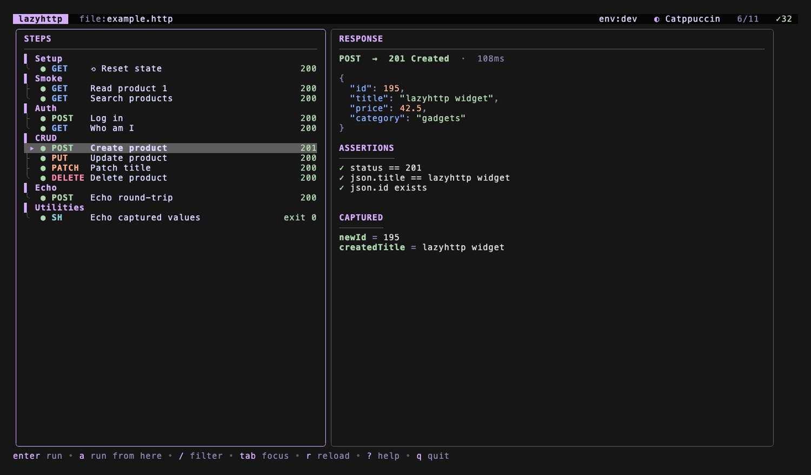

# lazyhttp

A terminal UI for running `.http` test plans step by step — like a `lazygit`/`k9s`
for your HTTP requests. Open any `.http` file (the same format used by the IntelliJ
HTTP Client and the VS Code REST Client), step through requests, capture values,
assert on responses, and fetch OAuth2 tokens automatically.



## Install

Pick whichever fits the machine — all three give you a `lazyhttp` on your `PATH`.

### Homebrew (macOS / Linux — no Go needed)

```sh
brew install wingedsheep/tap/lazyhttp
```

Upgrade later with `brew update && brew upgrade --cask lazyhttp`.

### curl one-liner (macOS / Linux — no Go, no Homebrew)

Downloads the latest prebuilt binary from GitHub Releases:

```sh
curl -fsSL https://raw.githubusercontent.com/wingedsheep/lazyhttp/main/install.sh | sh
```

It installs to `/usr/local/bin` if writable, otherwise `~/.local/bin`. Set a
custom location with `LAZYHTTP_INSTALL_DIR=/somewhere`.

### Scoop (Windows — no Go needed)

```powershell
scoop bucket add wingedsheep https://github.com/wingedsheep/scoop-bucket
scoop install lazyhttp
```

Or grab `lazyhttp_windows_<arch>.zip` from the
[latest release](https://github.com/wingedsheep/lazyhttp/releases/latest), unzip
it, and put `lazyhttp.exe` on your `PATH`. See the
[Windows notes](docs/http-format.md#windows-notes) for the default `@shell`
interpreter and CRLF handling.

### go install (any OS with Go 1.24+)

```sh
go install github.com/wingedsheep/lazyhttp@latest
```

This drops `lazyhttp` in your Go bin dir — make sure it's on your `PATH`:

```sh
# Add to ~/.zshrc (or ~/.bashrc) if `lazyhttp` isn't found after install:
export PATH="$PATH:$(go env GOPATH)/bin"
```

> **Don't have Go?** On macOS: `brew install go`. Or with mise: `mise use -g go@1.24`.

## Usage

Point it at any `.http` file:

```sh
lazyhttp example.http
lazyhttp --env dev example.http        # pick an environment from http-client.env.json
lazyhttp --theme dracula example.http  # set a colour theme (cycle in-app with `t`)
```

### Folder mode

Point it at a **directory** and lazyhttp lists every `.http` / `.rest` plan beneath
it (grouped by subfolder, with each file's step count), so a repo full of request
collections opens as one browsable overview:

```sh
lazyhttp .            # browse all plans under the current directory
lazyhttp ./api-tests  # …or any folder
```

Navigate with the same keys as the step list (`↑` `↓`, `g`/`G`, `^u`/`^d`, `/` to
filter by path), press `enter` to open the highlighted plan, and — k9s style — type
`:files` to jump back to the overview. Dot-directories, `node_modules`, and `vendor`
are skipped.

### Headless / CI

`lazyhttp run <plan.http>` executes a plan top-to-bottom without the TUI, prints a
per-step summary, and returns a CI-friendly exit code — `0` when every step and
assertion passed, `1` on any failure (transport error, non-2xx status, or a failed
`@assert`), `2` for usage/parse errors. A failed assertion against an otherwise
successful request still exits non-zero, which is the behaviour pipelines depend on.

```sh
lazyhttp run example.http                   # run the whole plan, exit 0/1
lazyhttp run --env dev example.http          # pick an environment
lazyhttp run --filter "Log in" example.http  # run only matching steps (method/name/group)
lazyhttp run --quiet example.http            # print only the final tally
lazyhttp run -o json example.http            # machine-readable report on stdout
lazyhttp run -o junit example.http > report.xml   # JUnit XML for CI test reporting
```

The chain stops at the first failing step, mirroring "run from here" in the TUI.
`--output` (alias `-o`) is `pretty` (default, coloured on a TTY), `json`, or `junit`;
the report goes to stdout and diagnostics to stderr, so redirection stays clean.

A GitHub Actions step:

```yaml
- run: lazyhttp run --env ci api/smoke.http -o junit > report.xml
- uses: dorny/test-reporter@v1
  if: always()
  with: { name: API smoke, path: report.xml, reporter: java-junit }
```

### Environments

If a `http-client.env.json` sits next to your `.http` file, `--env NAME` selects
a named environment and its values fill in `{{vars}}`:

```json
{
  "dev":     { "api": "https://dummyjson.com", "bin": "https://httpbin.org", "user": "emilys", "pass": "emilyspass" },
  "staging": { "api": "https://dummyjson.com", "bin": "https://httpbin.org", "user": "emilys", "pass": "emilyspass" }
}
```

### Keys

| Key            | Action                  |
| -------------- | ----------------------- |
| `↑` / `↓`      | move through steps / scroll the focused pane |
| `←` / `→`      | focus the plan / output pane |
| `tab`          | toggle pane focus       |
| `g` / `G`      | first / last step       |
| `^u` / `^d`    | half-page up / down     |
| `enter` / `e`  | run the selected step   |
| `a`            | run from here onward    |
| `r`            | reload the file         |
| `c` / `C`      | clear result / clear all|
| `i`            | toggle request preview  |
| `h`            | toggle response headers |
| `/`            | filter steps            |
| `t`            | cycle colour theme      |
| `E`            | switch environment      |
| `y` / `Y`      | copy body / response pane to clipboard |
| `?`            | full help               |
| `q` / `^c`     | quit                    |

You can also **click** a step in the plan pane to select and run it, click either
pane to focus it, and scroll with the mouse wheel.

In folder mode the overview shares the motion keys above; `enter` opens the
highlighted plan, and `:files` (or `Esc`) returns to the overview from an open
plan. `y` copies the raw response body (handy for grabbing JSON); `Y` copies the
whole response pane as shown. Copy uses your platform clipboard tool (`pbcopy`,
`clip`, or `wl-copy`/`xclip`/`xsel`).

## Writing `.http` files

The full `.http` syntax lazyhttp accepts — steps, the `# @name` / `# @group` /
`# @capture` / `# @assert` / `# @shell` / `# @reset` / `# @import` directives,
capture and assertion expressions, and `{{variable}}` resolution — is documented in
**[docs/http-format.md](docs/http-format.md)**. See [`example.http`](example.http)
for a complete, runnable tour.

### OAuth2 authentication

For APIs behind OAuth2, lazyhttp fetches and attaches a bearer token for you
instead of you hand-rolling a login request. It honors the IntelliJ HTTP
Client's `Security.Auth` block in `http-client.env.json`:

```json
{
  "dev": {
    "api": "https://api.example.com",
    "Security": {
      "Auth": {
        "demo": {
          "Type": "OAuth2",
          "Grant Type": "Client Credentials",
          "Token URL": "https://id.example.com/oauth/token",
          "Client ID": "demo-client",
          "Client Secret": "{{$processEnv OAUTH_CLIENT_SECRET}}",
          "Scope": "read"
        }
      }
    }
  }
}
```

Reference a configuration by id in a request and the token is resolved for you:

```http
### Protected request
GET {{api}}/me
Authorization: Bearer {{$auth.token("demo")}}
```

The token is fetched once and **cached** for the rest of the session (honoring
`expires_in`), so a plan of many requests does a single token fetch. Secrets stay
in the env file — never the plan — and the request preview shows the
`{{$auth.token(...)}}` placeholder, never the resolved token. Grant types:
**Client Credentials** and **Password** (the two that work without a browser).

Try it locally with no real provider — a bundled stub server makes
[`example.oauth.http`](example.oauth.http) runnable end-to-end:

```sh
just demo-server   # token endpoint + echo resource on :9000
just demo          # lazyhttp --env local example.oauth.http (in another terminal)
```

See [OAuth2 authentication](docs/http-format.md#oauth2-authentication) for the
full reference.

## Updating

- Homebrew: `brew update && brew upgrade --cask lazyhttp`
- curl: re-run the install one-liner
- Go: `go install github.com/wingedsheep/lazyhttp@latest`

`brew upgrade` only re-checks taps once per `HOMEBREW_AUTO_UPDATE_SECS` (24h
default), so run `brew update` first to pull the newest release immediately. If a
stale local tap clone still hides it, `brew reinstall --cask lazyhttp` forces it.
Check what you're on with `lazyhttp --version`.

## Building from source

```sh
git clone https://github.com/wingedsheep/lazyhttp.git
cd lazyhttp
go build -o bin/lazyhttp .
./bin/lazyhttp example.http
```
